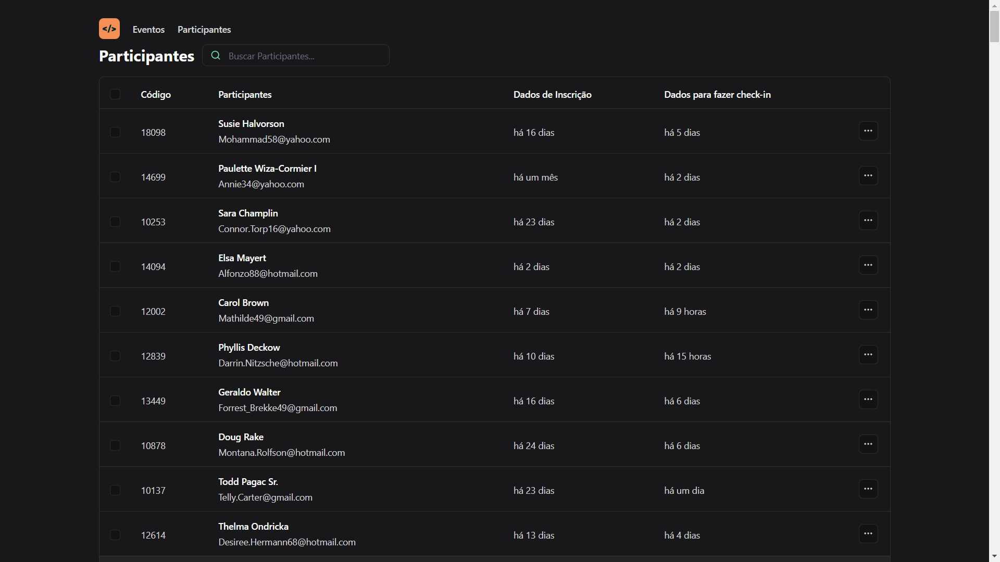

# Projeto - PASS-IN-WEB

Projeto tela de participantes, simula uma tela de eventos onde temos acesso aos participantes do evento, apenas quem esta gerenciando o evento tem acesso a esta tela. 
neste projeto usei uma api que gera estes participantes com id unico, onde uma vez que o participante fez sua inscrição e não consegue se reinscrever com o mesmo email, esta api gera o id, nome, email, data da inscrição, hora da inscriçao, e as seguintes tecnologias foram
 
VITE
 
REACT
 
TYPE SCRIPT
 
e para estilização usei o 
 
TAIWIND.CSS
 
Link do projeto
<a href="https://unite-react.vercel.app/">Clique Aqui<a/>
 

